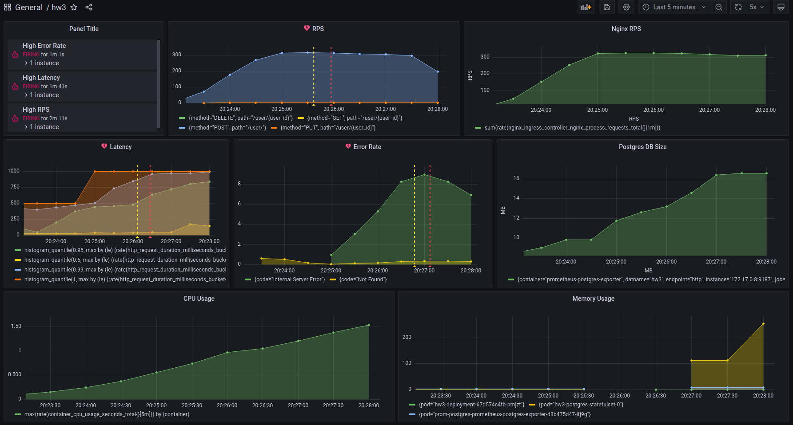

# Setup
To install Helm chart and all the necessary charts (including Nginx ingress controller, Prometheus stack and Postgres exporter) use this command:  
```. ./install.sh```

To uninstall chart and all dependencies use  
```. ./uninstall.sh```

Application service and Postgres exporter are installed within the `hw3` namespace, ingress controller is installed in `ingress-nginx` namespace, Prometheus stack is installed in `monitoring` namespace.  

Grafana dashboard named `hw3` is installed automatically and its definition can be found in `./resources/dashboard.json`

# Load Testing

Load testing is performed using Locust test suite. To start service testing use  
```. ./test.sh```  

Here is a dashboard screenshot after 5 minutes of locust runner work:  


# Application Description
There are five endpoints that application can handle:
* GET `/health` is used for healthcheck and returns `{"status": "OK"}`
* GET `/metrics` is used for metrics acquiring
* POST `/user` is used for user creation and returns response with "`user created`" message and status 200
* GET `/user/<user_id>` is used for user information acquiring and returns response with user data in JSON format
* PUT `/user/<user_id>` is used for user information updating and returns response with "`user updated`" message and status 200
* DELETE `/user/<user_id>` is used for user deletion and returns response with "`user deleted`" message and status 200

All endpoints return response with "`internal server error`" message and status 500 in case there were any errors during request processing.

# Resources description
Application resources include the following kinds:
* `Namespace`, which is applied first;
* `ConfigMap` + `Secret`, that are used for application configuration and storing DB credentials;
* `Deployment` + `Service` for application;
* `Ingress`, which can be turned off;
* `Service` + `StatefulSet` for Postgres;
* `Job` for migration, which creates `user` table in case it doesn't exist already and populates it with one record (`id=1`).

All resources are parameterized and should be installed via Helm.
