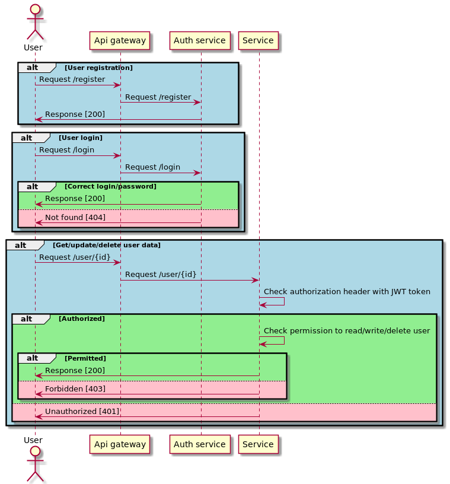

# Services interaction scheme


# Setup
```shell
helm install hw5 ./resources/chart/
```

All resources are automatically installed within Kubernetes namespace named `hw5`.

# Test cases

All test scenarios could be acquired via postman collection which is located in the `/tests` folder and could be run via newman: 
```shell
newman run ./tests/hw5_api_gateway.postman_collection.json
```

# Authorization service description
There are two endpoints that this application can handle:
* POST `/register` is used for user registration and returns `{"id": "X"}`
* POST `/login` is used for user login and returns `{"status": "OK"}` 200 in case user was able to authorize with provided username and password, and `Not found` 404 otherwise

# User service description
Authorization and permission to read/update/delete user data are checked for all the endpoints that this service can handle.  
All checks are done using middlewares on the `user` service side.  
Firstly we check `Authorization` header with JWT token that provide us all necessary information about logged user. In case there are no such header or token is incorrect, the response will be `Unauthorized` 401.  
Secondly we check user permissions comparing requested and logged user IDs. In case they are not equal (users can read and modify their own data only), the response will be `Forbidden` 403.  
Request proceeds to a service handler after all checks.  

There are three endpoints that this application can handle:
* GET `/user/<user_id>` is used for user information acquiring and returns response with user data in JSON format.
* PATCH `/user/<user_id>` is used for user information updating and returns `{"status": "OK"}`
* DELETE `/user/<user_id>` is used for user deletion and returns `{"status": "OK"}`

All endpoints return response with "`Internal server error`" message and status 500 in case there were any errors during request processing.

# Resources description
Application resources include the following kinds:
* `Namespace`, which is applied first;
* `ConfigMap` + `Secret`, that are used for application configuration and storing DB credentials;
* `Deployment` + `Service` for both applications;
* `Ingress`, which can be turned off;
* `Service` + `StatefulSet` for Postgres;
* `Job` for migration, which creates `user` table in case it doesn't exist already and populates it with one record (`id=1`).

All resources are parameterized and should be installed via Helm.
