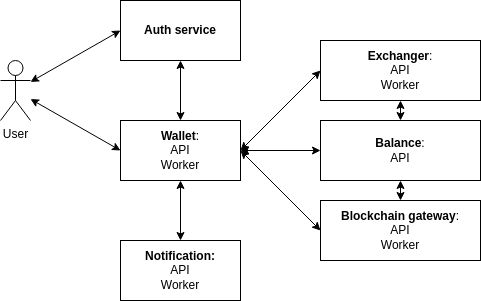
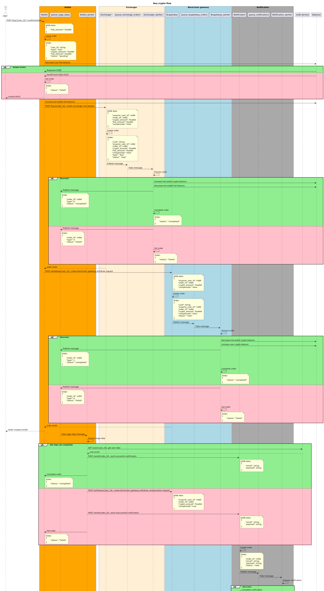
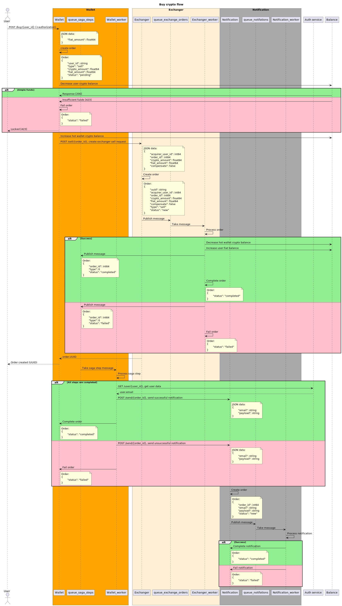

# Setup
```shell
. install.sh
```

All resources are automatically installed within Kubernetes namespace named `prj`.

To uninstall project one can use
```shell
. uninstall.sh
```

# Service description
This project is a stripped down version of a buying/selling crypto service. It consists of the following 6 services:    
* **Authorization service**   
  This service is dedicated to authorization/authentication and storing user data. It provides HTTP API for creating users, sign-in into user account and getting user data. The last of these methods is internal, i.e. unavailable from the outer network.    
  Authorization and permission to read/update/delete user data are checked for all the public endpoints that services can handle.  
  All checks are done using middlewares on the `user` service side.  
  Firstly we check `Authorization` header with JWT token that provide us all necessary information about logged user. In case there are no such header or token is incorrect, the response will be `Unauthorized` 401.  
  Secondly we check user permissions comparing requested and logged user IDs. In case they are not equal (users can read and modify their own data only), the response will be `Forbidden` 403.  
  Request proceeds to a particular service handler after all checks.
* **Wallet service**    
  This is the main service for handling buy/sell crypto flow processing. It provides HTTP API for creating wallet, getting wallet balance data, depositing fiat currency and creating orders for buying/selling crypto. All of these methods are public.
  Service comprises API and worker, that implements orchestration SAGA pattern for asynchronous order processing. Worker listens to `saga_steps` queue and processes response messages from **Exchanger**/**Blockchain gateway** services. In case there are some failed responses, worker creates compensation orders.
* **Balance service**
  This service is in charge of working with user wallet balances. It provides HTTP API for creating, getting and updating wallet balance. All these methods are private and therefore can be accessed only by services themselves.
* **Exchanger service**
  This service processes orders for buying/selling crypto on external exchangers. It provides HTTP API for these two flows and both methods are private.    
  Service comprises API and worker that communicate with each other via `exchange_orders` queue. Worker processes orders and publishes corresponding message to `saga_steps` queue.
* **Blockchain gateway service**
  This service processes orders for withdrawing cryptocurrency to crypto wallets. It provides HTTP API for this flow with private method.    
  Service comprises API and worker that communicate with each other via `bcgateway_orders` queue. Worker processes orders and publishes corresponding message to `saga_steps` queue.
* **Notification service**
  This service is dedicated to sending notifications about order processing result. It provides HTTP API for this flow with private method.    
  Service comprises API and worker that communicate with each other via `notifications` queue. API part creates order and publishes corresponding message to the queue, worker reads this message and sends notifications.

# Service interaction diagram


# Buy crypto flow

Flow of fiat and currency funds:
* Hold fiat (User -fiat, Hot wallet +fiat)
* Buy crypto (Hot wallet +crypto, Hot wallet -fiat)
* Withdraw (Hot wallet -crypto, User +crypto)



# Sell crypto flow

Flow of fiat and currency funds:
* Hold crypto (User -crypto, Hot wallet +crypto)
* Sell crypto (Hot wallet -crypto, User +fiat)



# Resources description
Application resources include the following kinds:
* `Namespace`, which is applied first;
* `ConfigMap` + `Secret`, that are used for application configuration and storing DB credentials;
* `Deployment` + `Service` for applications;
* `Ingress`, which can be turned off;
* `Service` + `StatefulSet` for Postgres;
* `Job` for migrations.

# Handlers description
**auth** - authorization/authentication and user data service for user registration and JWT token generation.
Handlers:
- >**POST** /register   
  Register a new user.  
  ```json
  {
    "username": "johndoe589",
    "first_name": "John",
    "last_name": "Doe",
    "email": "bestjohn@doe.com",
    "password": "password"
  }
  ```
- >**POST** /login      
  Log in as a particular user.
  ```json
  {
    "username": "johndoe589",
    "password": "password"
  }
  ```
- >**GET** /user/{user_id} (**internal**)*  
  Get user data.

**wallet** - main entry point service for buy/sell crypto flow processing and orchestration.     
Handlers:
- >**GET** /wallet/{user_id}    
  Get wallet data.
- >**POST** /wallet/{user_id}   
  Create wallet.
- >**PATCH** /wallet/{user_id}  
  Deposit fiat currency.
  ```json
  {
    "fiat_amount": 600
  }
  ```
- >**POST** /sell/{user_id}     
  Sell crypto for fiat.
  ```json
  {
    "crypto_amount": 1.5
  }
  ```
- >**POST** /buy/{user_id}      
  Buy crypto with fiat.
  ```json
  {
    "fiat_amount": 30
  }
  ```

**balance** - service for user crypto/fiat balance handling.     
Handlers:
- >**GET** /wallet/{user_id} (**internal**)*        
  Get wallet data.
- >**POST** /wallet/{user_id} (**internal**)*   
  Create wallet for a particular user.
- >**PATCH** /wallet/{user_id} (**internal**)*  
  Update wallet crypto/fiat balance.
  ```json
  {
    "crypto_amount": 30,
    "fiat_amount": 30
  }
  ```

**bc_gateway** - service intended for working with crypto wallets in blockchain     
**bc_gateway_worker** - inner worker for "external" requests processing     
Handlers:
- >**POST** /withdraw/{user_id} (**internal**)*   
  Withdraw crypto, move from one crypto wallet to another.
  ```json
  {
    "acquirer_user_id": 2,
    "order_id": 1,
    "crypto_amount": 3,
    "compensate": false  
  }
  ```

**exchanger** - service dedicated to work with crypto exchanger ("external" requests)       
**exchanger_worker** - inner worker for "external" requests processing      
Handlers:
- >**POST** /buy/{order_id} (**internal**)*   
  Buy crypto on external exchanger.
  ```json
  {
    "acquirer_user_id": 2,
    "order_id": 1,
    "crypto_amount": 3,
    "compensate": false  
  }
  ```
- >**POST** /sell/{order_id} (**internal**)*    
  Sell crypto on external exchanger.
  ```json
  {
    "acquirer_user_id": 2,
    "order_id": 1,
    "crypto_amount": 3,
    "compensate": false  
  }
  ```

**notification** - service for sending additional user notifications        
**notification_worker** - inner worker for "external" requests processing       
Handlers:
- >**POST** /send/{order_id} (**internal**)*    
  Send notification about order processing.

***internal** means that this endpoint is inaccessible from the outside, i.e. private.

# Test cases

All test scenarios could be acquired via postman collection which is located in the `/tests` folder and could be run via newman:
```shell
newman run ./tests/prj_final.postman_collection.json
```
